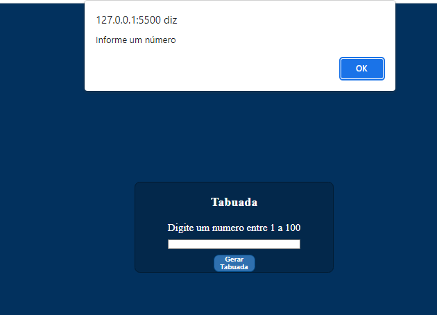
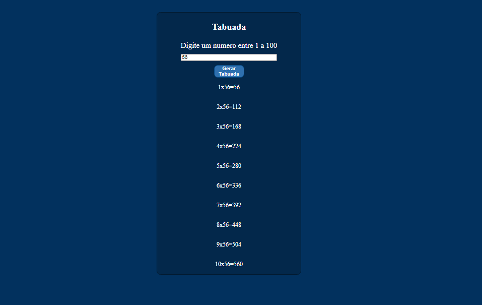

# tabuada
Exercicio da Etec com JavaScript, HTML e CSS
<h2>Apertando no botão gerar sem digitar um número</h2>

 
<h2>Inserindo um número para gerar a tabuada</h2>

## 🛠 Tecnologias utilizadas
-Javascript
- HTML
- CSS
- Git e Github

## 📖 O que aprendi

- Aprendi a criar variaveis no CSS.
- Aprendi estruturas condicionais (if, else) no JS.

## 📞 Contato
beatriizangelis@gmail.com

